# GONM Simulation Atlas

This document consolidates the organized visual simulations attached to `T07_GONM`.

The goal is not to claim that every demonstration proves industrial superiority. The more honest reading is:

- some demonstrations show strong practical advantage for the layered GONM search;
- some are mainly conceptual or variational proofs of concept;
- a few are explicitly cautionary and should not be oversold.

## Quick map

- Strong practical demonstrations:
  - logistics routing
  - satellite attitude control
  - smart-grid redispatch
  - inverted-pendulum feedback tuning
  - neural hyperparameter search
- Strong physical demonstrations:
  - `LJ-13`
  - `Ar13`
  - protein folding
- Strong variational demonstrations:
  - quantum ground-state search
  - quantum wavefunction optimization
  - relativistic geodesic search
  - boundary-value relativistic geodesic
- Mixed or cautionary demonstrations:
  - quantitative portfolio optimization
  - reduced cosmological N-body stability
  - chaotic contractive synchronization

## 1. LJ-13 Atomic Structure

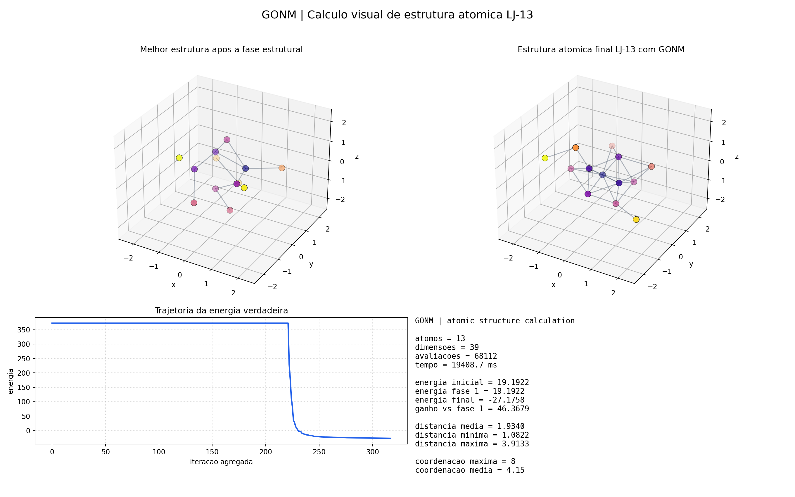

- Script: `simulations/gonm_atomic_structure_lj13.py`
- Final energy: `-27.1758`
- Gain vs phase 1: `46.3679`
- Mean pair distance: `1.9340`
- Reading: compact visual atomic-cluster demonstration; strong as a proof of layered physical optimization, but not a claim of exact global optimality.

## 2. Ar13 Atomic Structure

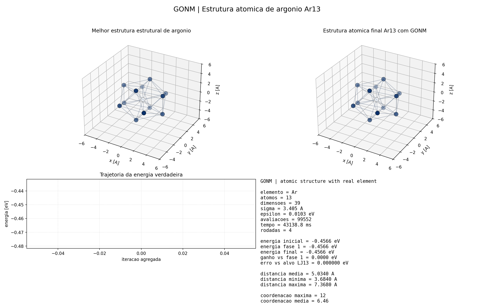

- Script: `simulations/gonm_atomic_structure_argon13.py`
- Element: `Ar`
- Final energy: `-0.4565659194 eV`
- Reference ground-state energy: `-0.4565660503 eV`
- Gap to reference: `1.31e-7 eV`
- Reading: practically perfect for the Lennard-Jones `Ar13` model used here.

## 3. Protein Folding

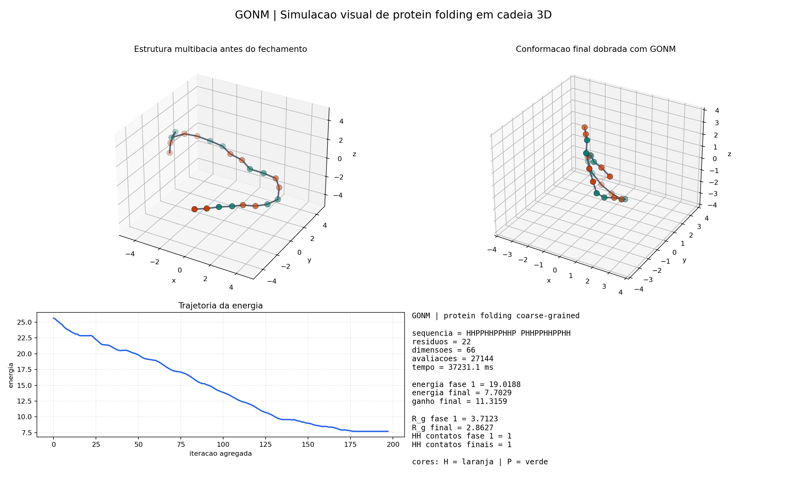

- Script: `simulations/gonm_protein_folding.py`
- Sequence length: `22`
- Final energy: `7.7029`
- Radius of gyration: `3.7123 -> 2.8627`
- Reading: coarse-grained three-dimensional folding proof of concept; visually convincing, but not a biophysical production simulator.

## 4. Quantitative Portfolio Optimization

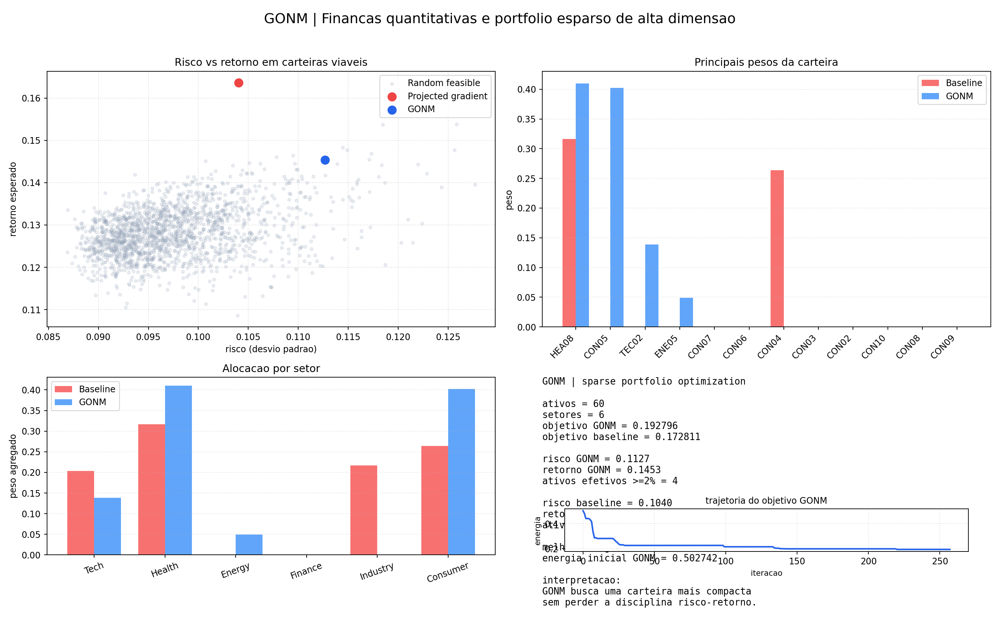

- Script: `simulations/gonm_quant_portfolio.py`
- Baseline objective: `0.172811`
- GONM objective: `0.192796`
- Effective assets `>= 2%`: baseline `4`, GONM `4`
- Reading: useful as a sparse portfolio-search demonstration, but this recorded run does not show superiority over the baseline.

## 5. Geometric VRP Logistics

- Script: `simulations/gonm_logistics_vrp.py`
- Delivery points: `120`
- Trucks: `6`
- Baseline total length: `425.58`
- GONM total length: `317.87`
- Relative gain: `25.31%`
- Reading: one of the clearest demonstrations of structural zoning plus local contraction improving a combinatorial routing problem.

## 6. Neural Hyperparameter Optimization

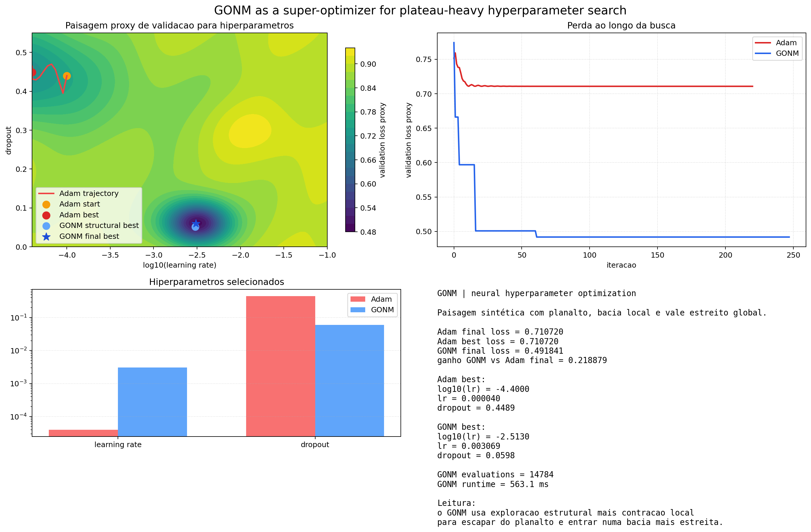

- Script: `simulations/gonm_neural_hyperopt.py`
- Adam final loss: `0.710720`
- GONM final loss: `0.491841`
- Gain vs Adam: `0.218879`
- Reading: strong plateau-crossing demonstration for hyperparameter landscapes; not a claim that GONM replaces Adam or SGD in real LLM training.

## 7. Neural Network Compression

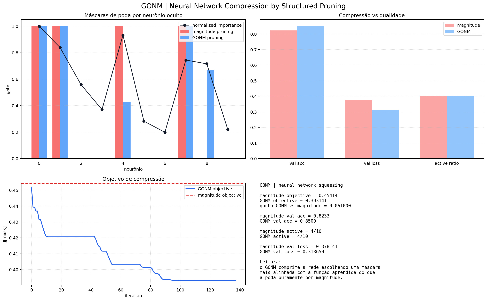

- Script: `simulations/gonm_neural_pruning.py`
- Magnitude-pruning objective: `0.454141`
- GONM pruning objective: `0.393141`
- Validation accuracy: `0.823333 -> 0.850000`
- Effective active neurons: `4/10` in both cases
- Reading: good structured-pruning demonstration for compact networks; narrower than real GPT compression, but conceptually aligned with model squeezing.

## 8. Quantum Ground-State Search

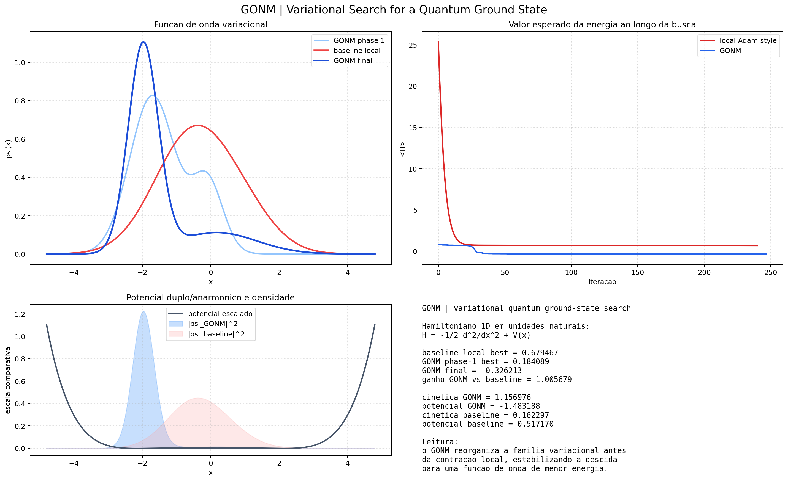

- Script: `simulations/gonm_quantum_ground_state.py`
- Local baseline best energy: `0.679467`
- GONM final energy: `-0.326213`
- Gain vs baseline: `1.005679`
- Reading: strong variational one-dimensional quantum demonstration with a meaningful Hamiltonian.

## 9. Quantum Wavefunction Optimization

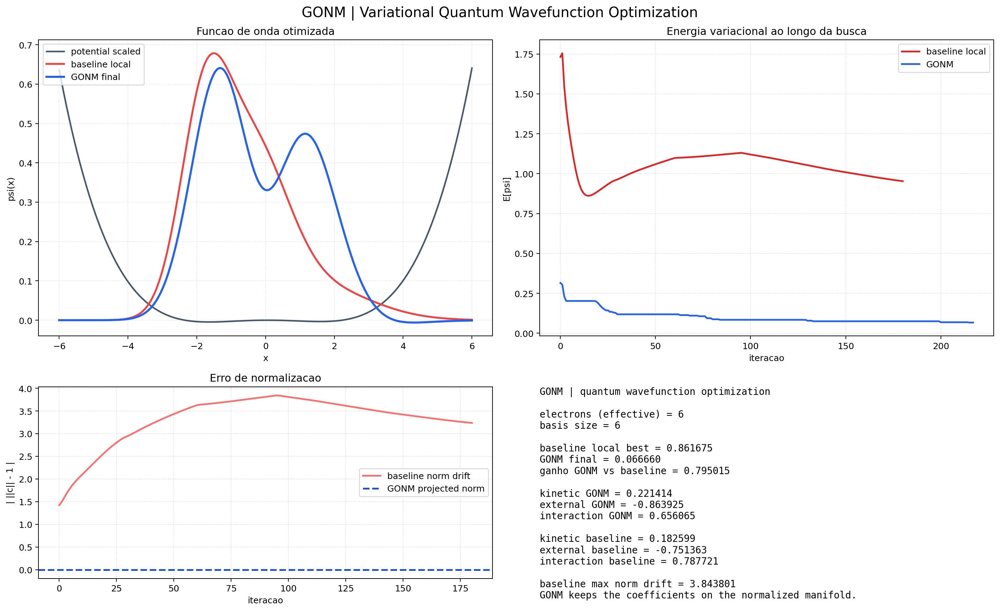

- Script: `simulations/gonm_quantum_wavefunction_optimization.py`
- Local baseline best energy: `0.861675`
- GONM final energy: `0.066660`
- Gain vs baseline: `0.795015`
- Baseline max norm drift: `3.843801`
- Reading: strong normalized variational-search demonstration; especially good for showing the role of contractive structure in keeping updates on a physical manifold.

## 10. Relativistic Geodesic Search

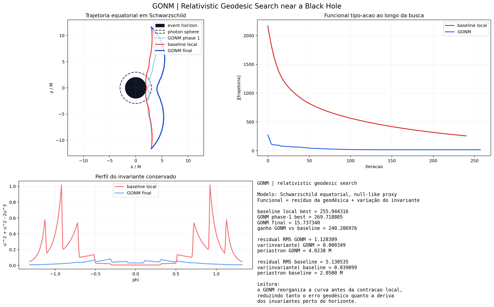

- Script: `simulations/gonm_relativistic_geodesic.py`
- Baseline functional: `255.944316`
- GONM functional: `15.737340`
- Gain vs baseline: `240.206976`
- Periastron: `4.0238 M`
- Reading: strong reduced variational strong-field demonstration; not a full Schwarzschild/Kerr integrator.

## 11. Boundary-Value Relativistic Geodesic

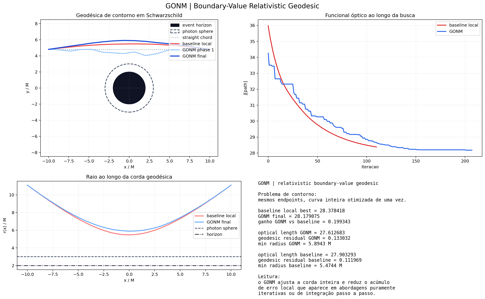

- Script: `simulations/gonm_relativistic_boundary_geodesic.py`
- Baseline functional: `28.378418`
- GONM functional: `28.179075`
- Gain vs baseline: `0.199343`
- Minimum radius: `5.8943 M`
- Reading: conceptually important because it optimizes the whole path at once; the numerical gain is smaller, but the formulation is elegant and relevant.

## 12. Inverted Pendulum Control

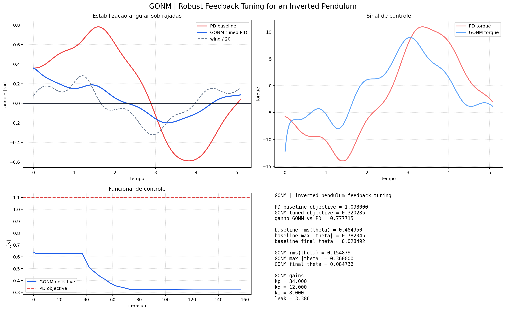

- Script: `simulations/gonm_control_inverted_pendulum.py`
- PD baseline objective: `1.098000`
- GONM objective: `0.320285`
- Gain vs PD: `0.777715`
- RMS angle: `0.484950 -> 0.154879`
- Reading: strong control-engineering demonstration of feedback tuning under disturbance.

## 13. Satellite Attitude Control

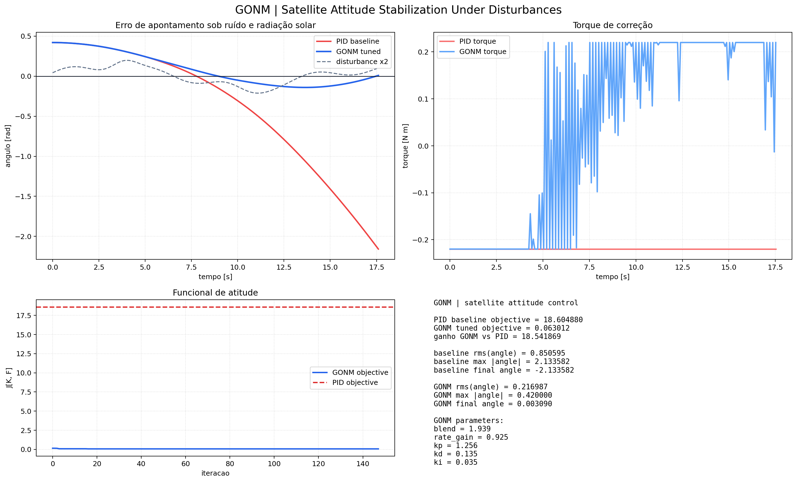

- Script: `simulations/gonm_satellite_attitude_control.py`
- PID baseline objective: `18.604880`
- GONM objective: `0.063012`
- Gain vs PID: `18.541869`
- RMS angle: `0.850595 -> 0.216987`
- Reading: one of the strongest industry-style results in the archive.

## 14. Smart Grid Economic Dispatch

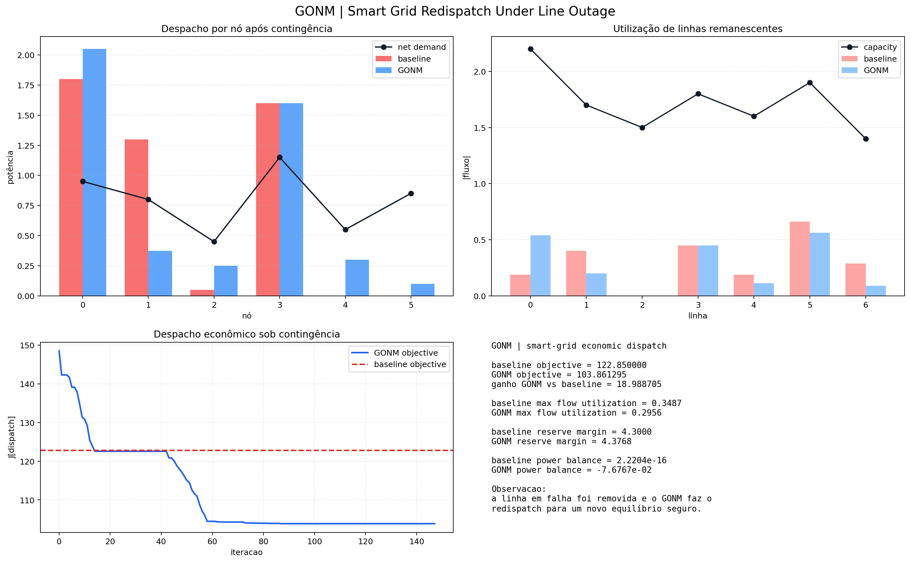

- Script: `simulations/gonm_smart_grid_dispatch.py`
- Baseline objective: `122.850000`
- GONM objective: `103.861295`
- Gain vs baseline: `18.988705`
- Max line utilization: `0.348684 -> 0.295587`
- Reading: convincing redispatch-under-contingency demonstration in a reduced grid.

## 15. Cosmological N-Body Stability

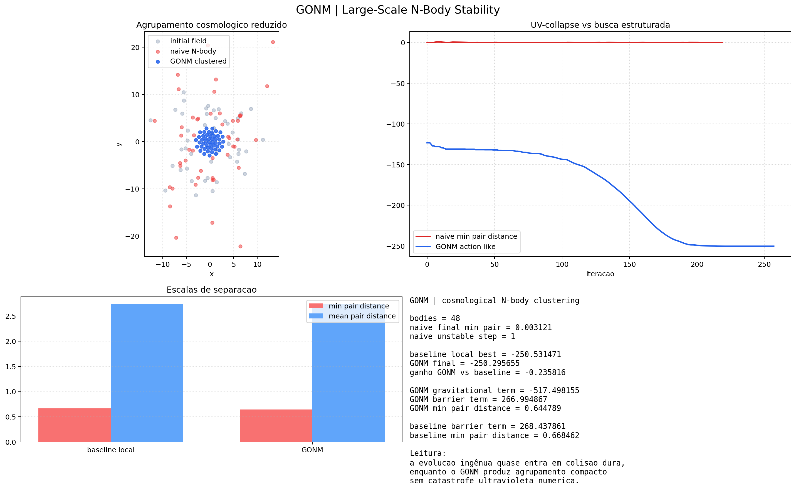

- Script: `simulations/gonm_cosmology_nbody.py`
- Naive minimum pair distance: `0.003121`
- Local baseline best functional: `-250.531471`
- GONM final functional: `-250.295655`
- GONM gain vs baseline: `-0.235816`
- Reading: mixed result numerically, but still useful as a stability demonstration because GONM keeps finite short-range separation while naive gravity approaches ultraviolet collapse.

## 16. Chaotic Contractive Synchronization

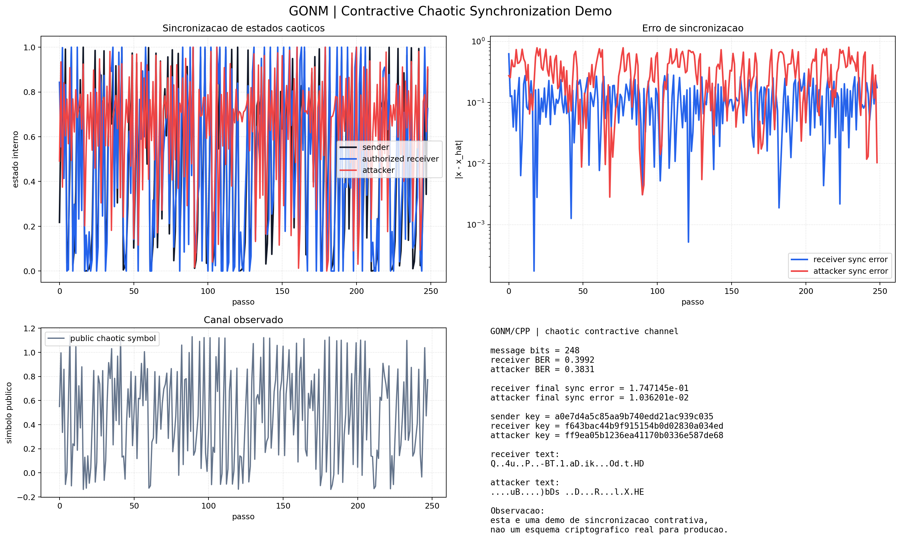

- Script: `simulations/gonm_chaotic_crypto.py`
- Receiver BER: `0.399194`
- Attacker BER: `0.383065`
- Receiver final sync error: `1.747145e-01`
- Attacker final sync error: `1.036201e-02`
- Reading: educational only. This is not a good cryptography result and should not be presented as secure communication.

## Overall reading

The archive now supports four different conclusions at once:

- `GONM` is strongest when the problem benefits from structural partition plus local contraction.
- Physical and geometric problems produce the most visually convincing demonstrations.
- Variational physics problems show that the architecture is not limited to discrete heuristics.
- Not every simulation is a “win”, and those mixed cases help keep the overall narrative honest.
