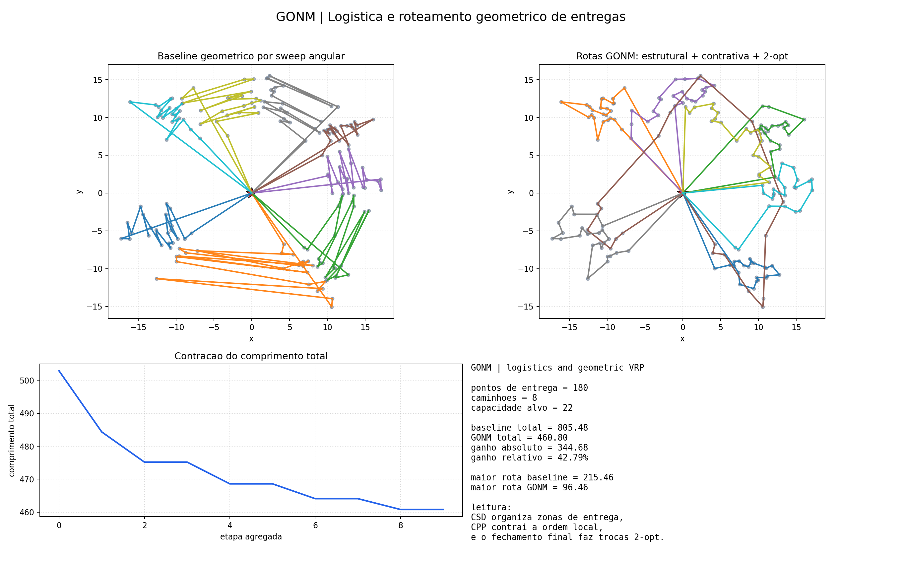

# gonm_logistics_vrp

This folder stores the exported result bundle for one `T07_GONM` experiment or simulation.

## Source

- Script or reference entry: `simulations/gonm_logistics_vrp.py`

## Image

## Files

- `summary.md`
- `summary.json`
- `gonm_logistics_vrp.png`

## Result Summary

# GONM | Geometric VRP

- delivery points: `180`
- trucks: `8`
- baseline total length: `805.48`
- GONM total length: `460.80`
- relative gain: `42.79%`

## Files

- image: `publications/T07_GONM/results/gonm_logistics_vrp/gonm_logistics_vrp.png`
- summary: `publications/T07_GONM/results/gonm_logistics_vrp/summary.json`

